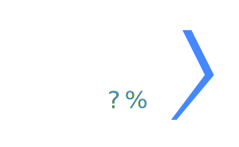

    

# WhereFor
Wherefore Art Thou PowerShell? Multiple Object Pipelines

## What Is WhereFor?

WhereFor is a small PowerShell module that combines Where-Object and Foreach-Object into a single useful command, `Get-WhereFor`.

Using WhereFor, it's simple and straightforward to check for multiple conditions in a single pipeline, thus avoiding repeated passes over the same data.

### Installing and Importing

You can install WhereFor from the PowerShell Gallery with Install-Module:

~~~PowerShell
Install-Module WhereFor -Scope CurrentUser
~~~

After installation, you can import the module by name:

~~~PowerShell
Import-Module WhereFor
~~~

### Examples

#### Get-WhereFor Example 1

~~~PowerShell
1..3 | ?% @{
    {$_ % 2} = {"$_ is odd"}
    {-not ($_ %2)}={"$_ is even"}
}
~~~
 #### Get-WhereFor Example 2

~~~PowerShell
Get-Process | 
    WhereFor @{
        { $_.Handles -gt 1kb } = { "$($_.Name) [ $($_.Id) ] has $($_.handles) open handles " }
        { $_.WorkingSet -gt 1gb } = { "$($_.Name) [ $($_.Id) ] is using $($_.WorkingSet) of memory" }
    }
~~~
 #### Get-WhereFor Example 3

~~~PowerShell
"the quick brown fox jumped over the lazy dog" -split '\s' | 
    Get-WhereFor ([Ordered]@{
        { $_ } =
            { "Word: $_"; "Length: $($_.Length)" }
        { $_ -match '[aeiou]' } =
            { "Vowels: $($_.ToCharArray() -match '[aeiou]')" }
        { $_ -match '[^aeiou]' } =
            { "Consonant: $($_.ToCharArray() -match '[^aeiou]')" }
    })
~~~

### How It Works

PowerShell is full of interesting features that are not broadly understood.  

WhereFor is built using one of these features, the [steppable pipeline](https://learn.microsoft.com/en-us/dotnet/api/system.management.automation.steppablepipeline?view=powershellsdk-7.4.0&wt.mc_id=MVP_321542).

SteppablePipelines allow you to run one more object pipelines step by step.

WhereFor works in a very simple way.  You provide one or more dictionaries or hashtables to WhereFor, and it creates a steppable pipeline for each condition and value.

If the condition returned a value, the action is run.
